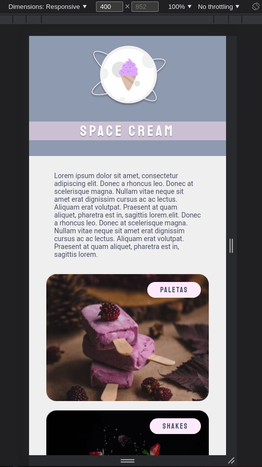
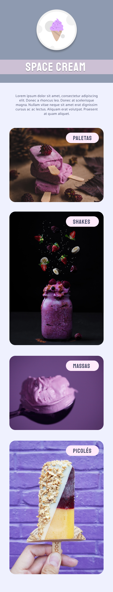

<h1 align="center">Mobile First! Animated webpage</h1>

<strong>PT-BR</strong>: Página em formato mobile com animações

 

   

## 🚀 Technologies 
<strong>EN:</strong> This project was developed with the following technologies:

-----
<strong>PT-BR:</strong> Esse projeto foi desenvolvido com as seguintes tecnologias:

- HTML e CSS
- Git e Github
- Figma

 

## 📖 Project
<strong>EN:</strong> Project made in Rocketseat's course "Explorer".
In this project, we see some new things as: simple animation of the images and texts, variables and flexible measurement units.

----
<strong>PT-BR:</strong> Neste projeto foram apresentadas novas funcionalidades, tais quais: animações simples de imagens e textos, uso de variáveis e unidades de medida flexíveis.
 
O layout para consulta foi enviado através da plataforma Figma.
 
Projeto feito no curso Explorer da Rocketseat
 
 
- Online project: https://lidiabrentano.github.io/mobile-first/
 

-----

By Lídia Brentano
